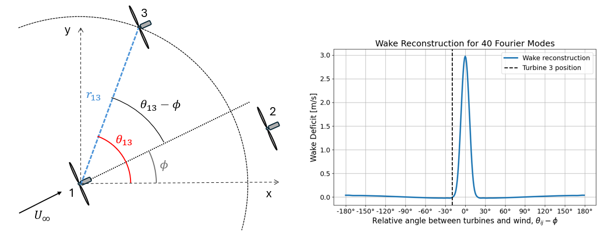
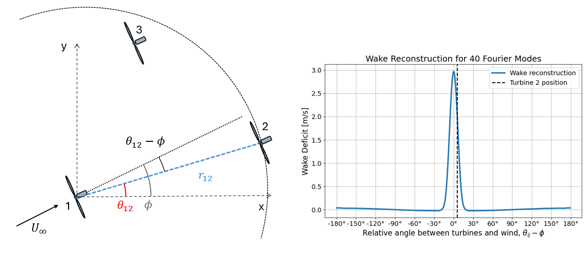

# Fuga FLOWERS
## FUGA FLOWERS - Linear summation

AEP is defined as

$$
AEP = 8760 \sum_{i=1}^N \int_u \int_{\phi} \frac{1}{8} \rho \pi D^2 u_i^3 C_P(u_i) f(u, \phi) du d\phi
$$

Taking outside the integral the constant values, defining $u_i$ as $u - \Delta u$ and being $\tilde u$ the normalized wind speed with respect to cut-out wind speed, $u_c$

$$
AEP = 8760 \frac{1}{8} \rho \pi D^2 u_c^3 \sum_{i=1}^N \int_{\tilde u} \int_{\phi}  (\tilde u - \Delta u_i)^3 C_P(\tilde u_i) f(\tilde u, \phi) d \tilde u d\phi
$$

Where the constant $8760 \frac{1}{8} \rho \pi D^2 u_c^3$ can be referred to as $Q$. In the case of fuga, $\Delta u$ is defined as 

$$
\Delta u_i = LUT(x, y) C_T(\tilde u_i) \tilde u_i z_0
$$

where LUT is the look-up table and $z_0$ is relating the non-neutral speed with the neutral one (taken from pyfuga documentation). Changing $x$ and $y$ to relative polar coordinates $r_{ij}$ and $\theta_{ij}$, normalized by the turbine diameter and $2 \pi$ respectively, and adding the wakes lineraly AEP becomes

$$
AEP = Q \sum_{i=1}^N \int_{\tilde u} \int_{\phi}  \left(\tilde u - \sum_{j=1, j \neq i} LUT(r_{ij}, \theta_{ij}) C_T(\tilde u_i) \tilde u z_0\right)^3 C_P(\tilde u_i) f(\tilde u, \phi) d \tilde u d\phi.
$$

Multiplying and simplifying the cubic term in the binomial

$$
\begin{align*}
AEP &= Q \sum_{i=1}^N \Bigg(\int_{\tilde u} \int_{\phi}  \tilde u C_P^{1/3}(\tilde u_i) f(\tilde u, \phi) d \tilde u d\phi \\ 
&- \sum_{j=1, j \neq i}^N \int_{\tilde u} \int_{\phi} LUT(r_{ij}, \theta_{ij}) C_T(\tilde u_i) \tilde u_i z_0 C_P^{1/3}(\tilde u_i)  f(\tilde u, \phi) d \tilde u d\phi \Bigg)^3.
\end{align*}
$$

In order to make the integral tractable, $C_P(\tilde u_i)$ and $C_T(\tilde u_i)$, now a function of the effective wind speed at each turbines, become a function of the freestream wind speed, that is, $C_P(\tilde u)$ and $C_T(\tilde u)$. In addition, the wind speed is reduced to use only a single wind speed bin per wind direction bin, the average wind speed $\hat u$. Thrust and power coefficients then become $C_P(\hat u(\phi))$ and $C_T(\hat u(\phi))$, and $f(\tilde u, \phi)$ is now $f(\phi)$.

$$
\begin{align*}
AEP =& Q \sum_{i=1}^N \Bigg(\int_{\phi} \hat u(\phi) C_P^{1/3}(\hat u(\phi)) f(\phi) d\phi \\ 
-& \sum_{j=1, j \neq i}^N \int_{\phi} LUT(r_{ij}, \theta_{ij}) C_T(\hat u(\phi)) \hat u(\phi) z_0 C_P^{1/3}(\hat u_i(\phi))  f(\phi) d\phi \Bigg)^3
\end{align*}
$$

The two integrals can be divided into $\overline p_{\infty}$ (left) and $\overline{\Delta p_{ij}}(r_{ij}, \theta_{ij})$ (right), which can be seen as the wind farm AEP with no wakes and the wake interactions, respectively

$$
AEP = Q \sum_{i=1}^N \left(\overline p_{\infty} - \sum_{j=1, j \neq i}^N \overline{\Delta p_{ij}}(r_{ij}, \theta_{ij}) \right)^3
$$

### No wakes term - $\overline p_{\infty}$

This term can be easily obtained by means of a basic rectangular quadrature

$$
\overline p_{\infty} = \sum_{d=1}^{N_{\phi}} C_P^{1/3}(\hat u(\phi_d)) \hat u(\phi_d) f(\phi_d)
$$

### Wake deficit term - $\overline{\Delta p_{ij}}(r_{ij}, \theta_{ij})$

In order to integrate the wake deficit term, all the terms which are a function of the discrete wind direction are expressed in a continuous analytical form using a discrete Fourier transform

$$
\begin{align*}
c(\phi) =& C_T(\hat u(\phi)) \hat u(\phi) C_P^{1/3}(\hat u_i(\phi)) f(\phi) \\
=& \frac{a_0}{2} + \sum_{m=1}^{M-1} a_m \cos(2 \pi m \phi) + b_m \sin(2 \pi m \phi)
\end{align*}
$$

where $a_0$, $a_m$ and $b_m$ are the Fourier coefficients and $M$ is the number of Fourier modes. For the case of $LUT(r_{ij}, \theta_{ij}) z_0$, a different Fourier Transform is done when setting up tha model. For a series or downstream (or upstream) distances, using as discrete inputs all wake deficits values at all the possible dowstream directions (0-360 $^{\circ}$) coming from the LUT, the discrete Fourier Transform converts this wake into a continuous function, with its respective Fourier coefficients, $c_m$ and $d_m$. This creates what could be referred to as a Look-up Table of Fourier coefficients, $LUTFC(r_{ij})$, as a function of the downstream distances. The new continuous function for the LUT can be expressed as

$$
w(r_{ij},\phi) = \frac{c_0(r_{ij})}{2} + \sum_{m=1}^{M-1} c_m(r_{ij}) \cos(2 \pi m \phi) + d_m(r_{ij}) \sin(2 \pi m \phi)
$$

A visual representation of this continuous function representing the wake can be seen in the figures below, where based on the downstream distance, the wake is reconstructed. Knowing the relative angle with respect to the wind direction, $\theta_{ij}-\phi$, it is possible to know the wake deficit for a turbine with a known $r_{ij}$ and  $\theta_{ij}$.

With all this is mind and introducing the integration variable, $\alpha = \theta_{ij}-\phi$ to represent the normalized polar angle relative to the wind direction, $\overline{\Delta p_{ij}}(r_{ij}, \theta_{ij})$ can be expressed as

$$
\begin{align}
\overline{\Delta p_{ij}}(r_{ij}, \theta_{ij}) =& \int_{\phi} c(\alpha) w(r_{ij},\alpha) d\alpha \\
=& \int_{\phi} \left[\frac{a_0}{2} + \sum_{m=1}^{M-1} a_m \cos(2 \pi m \alpha) + b_m \sin(2 \pi m \alpha)\right] \\
& \left[\frac{c_0(r_{ij})}{2} + \sum_{m=1}^{M-1} c_m(r_{ij}) \cos(2 \pi m \alpha) + d_m(r_{ij}) \sin(2 \pi m \alpha)\right] d\alpha
\end{align}
$$

After simplifications thanks to orthogonality, $\overline{\Delta p_{ij}}(r_{ij}, \theta_{ij})$ can be obtained using

$$
\begin{align*}
\overline{\Delta p_{ij}}(r_{ij}, \theta_{ij}) &= \frac{a_0 c_0(r_{ij})}{4}  + \frac{1}{2} \sum_{m=1}^{M-1} \Bigg[\Big(a_m c_m(r_{ij}) - b_m d_m(r_{ij})\Big) \cos(2 \pi m \theta_{ij}) \\
&+ \Big(a_m d_m(r_{ij}) + b_m c_m(r_{ij})\Big) \sin(2 \pi m \theta_{ij}) \Bigg]
\end{align*}
$$

It is important to note that the construction of the wake deficit using Fourier modes for a series of downstream distances, as well as the discrete Fourier Transform for the wind direction dependent terms, is done when setting up the wind farm, and takes less than half a second, depending on the size of the LUT. These makes Fuga FLOWERS remarkably fast. Also, as can be noticed in the two figures attached, the use of Fuga Wake model and the integration in the entire range of wind directions, enables this AEP model to account for blockage effects.

## FUGA FLOWERS - Binomial expansion

Similar to the "linear summation" derivation, when adding the wake contributions linearly, AEP can be defined as 

$$
AEP = 8760 \frac{1}{8} \rho \pi D^2  \sum_{i=1}^N \int_{u} \int_{\phi} u^3 \left(1 - \sum_{j=1,j\neq i}^{N} \frac{\Delta u_i}{u}\right)^3 C_P(u_i) f( u, \phi) du d\phi
$$

where in this derivation, the wind speed is not normalized with respect to the cut-out wind speed, and so $Q$ now is $8760 \frac{1}{8} \rho \pi D^2$. In this case, the integral is not divided into two as in the "linear summation" derivation, but the binomial is expanded:

$$
\left(1 - \sum \frac{\Delta u_i}{u}\right)^3 = 1 - 3 \left(\sum \frac{\Delta u_i}{u}\right) + 3 \left(\sum \frac{\Delta u_i}{u}\right)^2 - \left(\sum \frac{\Delta u_i}{u}\right)^3
$$

where the last cubic term can be considered as negligible. AEP is then defined as

$$
AEP = Q \sum_{i=1}^N \int_{u} \int_{\phi} u^3 C_P(u_i) f( u, \phi) \left( 1 - 3 \left(\sum \frac{\Delta u_i}{u}\right) + 3 \left(\sum \frac{\Delta u_i}{u}\right)^2\right)du d\phi
$$

Using the same simplification as in the "linear expansion" derivation, a single wind speed bin is used per wind direction bin, the average wind speed $\hat u$. Moreover, $\frac{\Delta u_i}{u}$ for Fuga is defined as

$$
\frac{\Delta u_i}{u} = LUT(x, y) C_T(u_i) z_0,
$$

and once again, in order to make the integral tractable, $C_P(\hat u_i)$ and $C_T(\hat u_i)$, now a function of the effective wind speed at each turbines, become a function of the freestream wind speed, that is, $C_P(\hat u)$ and $C_T(\hat u)$. The binomial terms are linearized by $\left(\sum \frac{\Delta u_i}{u}\right)^2 = \sum \left(\frac{\Delta u_i}{u}\right)^2$ turning the AEP function in polar coordinates into

$$
AEP = Q \sum_{i=1}^N  \int_{\phi} \hat u^3(\phi) C_P (\hat u(\phi)) f(\phi) \Big(I_0 - 3 I_1 + 3 I_2 \Big)d\phi,
$$

with 

$$
I_0 = 1
$$
$$
I_1 = \sum_{j=1, j\neq i}^N \Big(LUT(r_{ij}, \theta_{ij}) C_T(\hat u(\phi)) z_0\Big),
$$
$$
I_2 = \sum_{j=1, j\neq i}^N \Big(LUT(r_{ij}, \theta_{ij}) C_T(\hat u(\phi)) z_0\Big)^2
$$

where the $x$ and $y$ coordinates have been transformed into polar coordinates, with $r_{ij}$ normalized with the rotor diameter. The terms which are a function of the discrete wind direction, $\phi$ can be transformed into a continuous function using a discrete Fourier Transform, with a different transformation for each of the 3 terms, $I_0, I_1$ and $I_2$:

$$
c_0(\phi) = \hat u^3(\phi) C_P (u(\phi)) f(\phi) = \frac{a_{0,0}}{2} + \sum_{m=1}^{M-1} a_{0,m} \cos(2 \pi m \phi) + b_{0,m} \sin(2 \pi m \phi).
$$
$$
c_1(\phi) = \hat u^3(\phi) C_P (\hat u(\phi)) f(\phi) C_T(\hat u(\phi)) = \frac{a_{1,0}}{2} + \sum_{m=1}^{M-1} a_{1,m} \cos(2 \pi m \phi) + b_{1,m} \sin(2 \pi m \phi).
$$
$$
c_2(\phi) = \hat u^3(\phi) C_P (\hat u(\phi)) f(\phi) C_T^2(\hat u(\phi)) = \frac{a_{2,0}}{2} + \sum_{m=1}^{M-1} a_{2,m} \cos(2 \pi m \phi) + b_{2,m} \sin(2 \pi m \phi).
$$

This converts the function into

$$
AEP = Q \sum_{i=1}^N  \int_{\phi} c_0(\phi) - 3 c_1(\phi) LUT(r_{ij}, \theta_{ij}) z_0 + 3 c_2(\phi) LUT(r_{ij}, \theta_{ij}) z_0 d\phi,
$$

which then using a similar approach to that of the "linear summation" to obtain the Fourier modes for the LUT, the following Fourier series are obtained:

$$
w(r_{ij},\phi) = LUT(r_{ij}, \theta_{ij}) z_0 = \frac{c_0(r_{ij})}{2} + \sum_{m=1}^{M-1} c_m(r_{ij}) \cos(2 \pi m \phi) + d_m(r_{ij}) \sin(2 \pi m \phi).
$$

This results in the final integration to be solved to estimate AEP

$$
AEP = Q \sum_{i=1}^N  \int_{\phi} c_0(\phi) - 3 c_1(\phi) w(r_{ij},\phi) + 3 c_2(\phi) w(r_{ij},\phi) d\phi,
$$

with the following solutions

$$
\int_{\phi} c_0(\phi) d\phi = a_{0,0}
$$
$$
\int_{\phi} c_1(\phi) w(r_{ij},\phi) d\phi = \frac{1}{2} \sum_{m=1}^{M-1} \Big(a_{1,m} \cos(m \theta_{ij}) + b_{1,m} \sin(m \theta_{ij})\Big) c_m(r_{ij})
$$
$$
\int_{\phi} c_2(\phi) w(r_{ij},\phi) d\phi = \frac{1}{2} \sum_{m=1}^{M-1} \Big(a_{2,m} \cos(m \theta_{ij}) + b_{2,m} \sin(m \theta_{ij})\Big) d_m(r_{ij})
$$

## Induction effects considerations

The Look-Up Table generated for fuga considers the turbine's effects both up and downstream. These enables the AEP estimation using this model to account for induction effects, although limited. As explained in the derivation of the FLOWERS AEP model, the thrust and power coefficients, $C_T$ and $C_P$, are a function of the average freestream wind speed. The goal when accounting for induction effects is to consider the effect other turbines have on each other's effective wind speed. However, given FLOWERS's approach, any turbine interactions are disregarded when obtaining the two coefficients, therefore being only considered for the wind speed used to obtain the power output, hence the _limited_ effect of including induction on the AEP estimation.

To consider or not these inductions effects, the configuration changes slightly. In the case of considering them, the procedure remains the same as that explained until now, given that continuous representation of the wake explained in the derivation performs a $360^{\circ}$ sampling, thus including upstream effects. On the other hand, to disregard induction effects, this representation is limited only to the half of the circle that is behind the turbine, leaving the other half as a constant zero.

## Including atmoshperic stability in the model

The Fuga FLOWERS wake model generates a Look Up table using a linearized RANS solver, which can take atmoshperic stability into account. Here is an attempt to consider atmospheric stability in the AEP estimation. The procedure is simple. It is necessary to know the "stability rose", or the probability of each stability condition ($\Omega$) consideredc, for each wind speed in the wind rose, that is $f(\Omega|u)$, and the LUT table for each $\Omega$. For both approaches, this implementation can be used both for using the LUTs and the fLUTs.

### Fuga FLOWERS with stability - Linear summation

It is possible to obtain the AEP computing $\overline{\Delta p_{ij}}(r_{ij}, \theta_{ij})$ for each atmoshperic scenario, $\overline{\Delta p_{ij}}(r_{ij}, \theta_{ij}, \Omega_k)$, since the wake free component does not depend on stability. AEP then becomes

$$
AEP = Q \sum_{i=1}^N \left(\overline p_{\infty} - \sum_{k=1}^{N_{\Omega}} \sum_{j=1, j \neq i}^N \overline{\Delta p_{ij}}(r_{ij}, \theta_{ij}, \Omega_k) \right)^3
$$

The atmoshperic stability conditional probability, $f(\Omega|u)$, is included in $\overline{\Delta p_{ij}}(r_{ij}, \theta_{ij})$ as 

$$
\overline{\Delta p_{ij}}(r_{ij}, \theta_{ij}) =\int_u \int_{\phi} LUT(r_{ij}, \theta_{ij},\Omega) C_T(u) u(\phi) z_0 C_P^{1/3}(u)  f(\phi, u) f(\Omega|u) du d\phi
$$

In order to continue with the derivation, the wind speed dimesions must be reduced to average wind speed. To do so, the $f(\Omega|\hat u)$, or $f(\Omega|\phi)$, is derived by weight averaging the $f(\Omega|u)$ based on the energy coming from each wind speed, using

$$
f(\Omega|\phi) = \frac{\sum_{s=1}^{N_u} u_s^3 C_P f(u_i|\phi) f(\Omega|u)}{\sum_{s=1}^{N_u} u_s^3 C_P f(u_s|u)}
$$

where $f(u_s|\phi)$ is the porbability of the wind speed bin $s$ in the specific wind direction $\phi$, drawn from the wind rose. Being this a function of wind direction, it can be included into the terms which are transformed into a continuous form using the discrete Fourier Transform, being $c(\phi)$ therefore

$$
c(\phi) = C_T(\hat u(\phi)) \hat u(\phi) C_P^{1/3}(\hat u_i(\phi)) f(\phi) f(\Omega|\phi)
$$

Provided that the Fourier coefficients are compute before the AEP computation, estimating the AEP with this method will take approximmately $N_{\Omega}$ times more that without stability. These Fourier coefficients computed before hand can be used for any layout, therefore being useful for layout optimization purposes.

### Fuga FLOWERS with stability - Binomial expansion

In this case, there is no differentiation between the AEP without wakes and that with wake interactions, making the implementation even simpler. The atmoshperic stability conditional probability derived above, $f(\Omega|\phi)$, is included in the AEP as 

$$
\begin{align*}
AEP &= Q \sum_{k=1}^{N_{\Omega}} \sum_{i=1}^N \int_{u} \int_{\phi} u^3 C_P(u_i) f( u, \phi) f(\Omega|\phi) \\
& \left( 1 - 3 \left(\sum \frac{\Delta u_i}{u}(\Omega) \right) + 3 \left(\sum \frac{\Delta u_i}{u}(\Omega) \right)^2\right)du d\phi
\end{align*}
$$

where the discrete functions to be transformed into a continuous form using the discrete Fourier transform are

$$
c_0(\phi) = \hat u^3(\phi) C_P (u(\phi)) f(\phi) f(\Omega|\phi)
$$
$$
c_1(\phi) = \hat u^3(\phi) C_P (\hat u(\phi)) f(\phi) C_T(\hat u(\phi)) f(\Omega|\phi)
$$
$$
c_2(\phi) = \hat u^3(\phi) C_P (\hat u(\phi)) f(\phi) C_T^2(\hat u(\phi)) f(\Omega|\phi)
$$

with the rest of the derivation remaining the same as for the case without stability. As for the linear approach, this method is expected to take around $N_{\Omega}$ times longer that for a single atmospheric condition, provided that the Fourier coefficients are compute before hand.