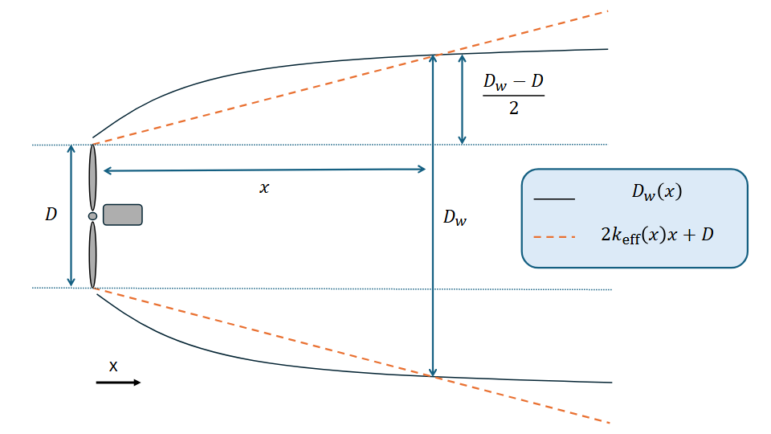

# Nygaard TurbOPark

TurbOPark wake model is a top-hat model, therefore, similarly to NOJ, the velocity deficit is uniformly distributed across the surface of the wake perpendicular to the axis of the wind turbine. Unlike NOJ, NTP's wake expansion is proportional to the local TI rather than a constant expansion rate. This local TI is the local and wake induced turbulence added in quadrature. The resulting wake deficit for a downstream distance of $x$ is

$$
\frac{\Delta u}{u_0}(x) = \left(1 - \sqrt{1 - C_T} \right) \left( \frac{D}{D_w(x)} \right)^2
$$

where $D$ is the wind turbine rotor diameter and $D_w(x)$ is the wake diameter at a distance $x$. Whereas for NOJ $D_w(x)$ can be defined as $D + 2 k x$, being $k$ a constant expansion coefficient, for the NTP model, after including the local turbulence, $D_w(x)$ becomes

$$
D_w(x) = D + \frac{AI_0D}{\beta}\left(
\sqrt{(\alpha + \beta x/D)^2 + 1} - \sqrt{1 + \alpha^2} 
- \ln\left[\frac{\left(\sqrt{(\alpha + \beta x/D)^2 + 1} + 1\right)\alpha}{\left(\sqrt{1 + \alpha^2} + 1\right)(\alpha + \beta x/D)}\right]
\right),
$$

where $I_0$ is the background atmospheric turbulence and $\alpha$ and $\beta$ are auxiliary positive variables defined as $\alpha = c_1 I_0$ and $\beta = c_2 I_0 / \sqrt{C_T(u_0)}$ with $c_1=1.5$ and $c_2=0.8$. Finally $A$ is a calibrated expansion coefficient, which recommended value for offshore wind farms is 0.6. Such a wake model implementation into FLOWERS would not be tractable given the complexity and nature of the equation. Nevertheless, the only difference with respect to the NOJ is the wake radius, no longer a function of the constant wake coefficient $k$. With the goal of following a similar implementation, the wake function ins transformed into

$$
\frac{\Delta u}{u_0}(x) = \frac{1 - \sqrt{1 - C_T}}{2 k_{\mathrm{eff}}(x) / D + 1}
$$

where $k_{\mathrm{eff}}(x)$ represents the effective wake expansion coefficient at a downstream distance $x$ which yields an equal wake diameter to that obtained using the TurbOPark wake diameter. This $k_{\mathrm{eff}}(x)$ is obtained for every pair of wind turbines $i$ and $j$ in the wind farm, and is defined as 

$$
k_{\mathrm{eff}}(x) = \frac{1}{2} \frac{\Delta D_W}{\Delta x} = \frac{D_w(x) - D}{2x}
$$

where $x$ is the downstream position from the wake generating turbine. A visual representation of the effective wake expansion coefficient is displayed in below.

This adaptation matches the formulation in NOJ-FLOWERS, enabling the exact same derivation for the AEP model. However, the presence of the $C_T$ inside the $\beta$ factor in the wake diameter results in the impossibility of including it among the discrete inputs as a function of wind directions that are transformed into continuous form by means of the discrete Fourier transform. For this reason, a universal thrust coefficient, or $\overline{C_T}$, is used, similar to the one introduced for Gaussian-FLOWERS, based on weight averaging the thrust coefficient by expected power production, defined as

$$
\overline{C_T} = \sum_{i=1}^{N_{\theta}} f_i C_T(U_{0,i}) \frac{C_p(U_{0,i}) U_{0,i}^3}{\sum_I C_p(U_{0,i}) U_{0,i}^3}.
$$

Using this effective expansion wake coefficient, the FLOWERS AEP implementation is close to that found in \cite{locascio_flowers_2024}, with the substitution of $k$ with $k_{\mathrm{eff}}$.
